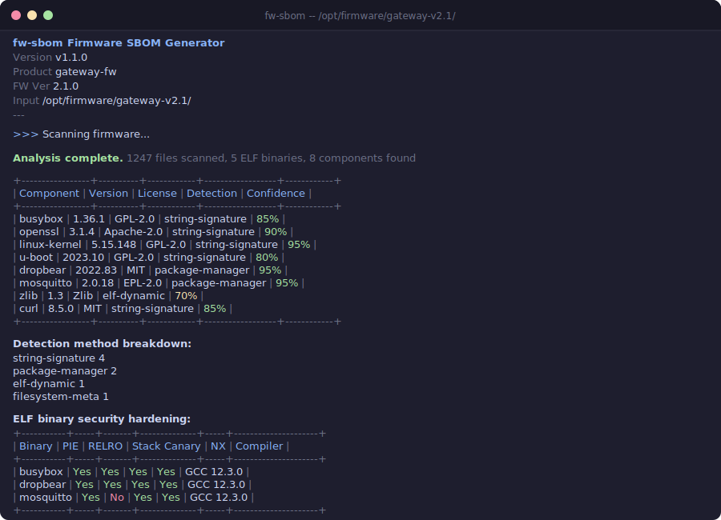

# fw-sbom



Firmware Software Bill of Materials (SBOM) generator. Scans extracted firmware images for software components and produces machine-readable SBOM documents in **SPDX 2.3** or **CycloneDX 1.6** JSON format.

Built to help device manufacturers and integrators meet the transparency requirements of the **EU Cyber Resilience Act (CRA)**, which mandates that products with digital elements ship with an accurate software bill of materials.

## What it does

`fw-sbom` analyzes an extracted firmware directory tree and identifies software components through multiple detection methods:

1. **ELF dynamic linkage** -- parses ELF binaries and extracts dynamically linked shared libraries (e.g. `libssl.so`, `libz.so`), mapping them to known packages.
2. **Deep ELF analysis** -- extracts SONAME, NEEDED entries, RPATH/RUNPATH, build-id from `.dynamic` section; detects compiler (GCC/Clang version) from `.comment` section; checks security hardening flags (PIE, RELRO, NX, stack canary).
3. **String-signature scanning** -- searches binary contents for known version strings and identifiers of 54+ common embedded packages.
4. **Package manager metadata** -- reads `opkg` and `dpkg` status files and individual `.control` files to extract installed package lists with exact versions.
5. **Filesystem metadata** -- parses `/etc/os-release` and `/etc/openwrt_release` for distribution information.
6. **License detection** -- scans LICENSE/COPYING files for known license text, detects SPDX-License-Identifier headers, and maps packages to licenses.
7. **Crypto algorithm detection** -- identifies AES and SHA-256 implementations by scanning for algorithm constants (S-box values, initialization vectors).
8. **Kernel config analysis** -- parses `/boot/config-*` for security-relevant kernel settings (stack protector, ASLR, SELinux, seccomp, etc.).

For every discovered component the tool records: name, version (when detectable), SHA-256 hash, SPDX license identifier, Package URL (purl), detection method, and confidence score.

## What's new in v1.1.0

- **VEX generation** (`--vex`): produces an OpenVEX document alongside the SBOM, mapping known CVEs to components with exploitability status.
- **SBOM merge** (`--merge`): combine multiple SBOM files into one, deduplicating components by name and version.
- **Schema validation** (`--validate`): structural validation of the generated SBOM JSON against required fields.
- **Parallel scanning**: file analysis now uses rayon for multi-threaded scanning, significantly faster on multi-core systems.
- **CycloneDX 1.6**: output updated from spec 1.5 to 1.6.
- **Machine-readable quiet mode**: `--quiet` now emits a JSON summary to stderr.
- **Fewer false positives**: documentation and license files are excluded from binary signature scanning.
- **Symlink handling**: symlinked files are no longer followed, avoiding incorrect SHA-256 hashes.

See [CHANGELOG.md](CHANGELOG.md) for the full version history.

## Build

Requires Rust 1.70+ and Cargo.

```
cd tools/fw-sbom
cargo build --release
```

The binary is placed at `target/release/fw-sbom`.

## Usage

```
fw-sbom [OPTIONS] <INPUT>

Arguments:
  <INPUT>  Path to extracted firmware directory or file to analyze

Options:
  -f, --format <FORMAT>          Output SBOM format: spdx or cyclonedx [default: spdx]
  -o, --output <FILE>            Output file path (prints to stdout if omitted)
  -n, --name <NAME>              Firmware / product name [default: firmware]
      --fw-version <FW_VERSION>  Firmware / product version [default: 0.0.0]
      --diff <FILE>              Compare with another SBOM file (diff mode)
      --enrich                   Add CPE identifiers and vulnerability hints
      --graph                    Output dependency graph in DOT format
      --exclude <PATTERN>        Exclude paths matching pattern (repeatable)
      --min-confidence <FLOAT>   Minimum confidence score 0.0-1.0 [default: 0.0]
      --merge <FILE>...          Merge multiple SBOM files into one
      --vex                      Generate VEX document alongside SBOM
      --validate                 Validate generated SBOM against JSON schema
      --quiet                    Suppress colored output; emit JSON summary to stderr
  -h, --help                     Print help
  -V, --version                  Print version
```

### Examples

Generate an SPDX SBOM from an extracted OpenWrt root filesystem:

```bash
fw-sbom ./openwrt-rootfs/ \
  --format spdx \
  --name "gateway-fw" \
  --fw-version "2.4.1" \
  --output gateway-sbom.spdx.json
```

Generate a CycloneDX SBOM with CPE enrichment and VEX:

```bash
fw-sbom ./extracted-firmware/ \
  --format cyclonedx \
  --enrich \
  --vex \
  --output firmware-sbom.cdx.json
```

This produces both `firmware-sbom.cdx.json` (the SBOM) and `firmware-sbom.vex.json` (the VEX document).

Compare two firmware SBOMs to see what changed between releases:

```bash
fw-sbom old-sbom.spdx.json --diff new-sbom.spdx.json
```

Merge SBOMs from multiple firmware partitions into one:

```bash
fw-sbom dummy --merge rootfs-sbom.json modem-sbom.json radio-sbom.json \
  --name "combined-fw" --output combined.spdx.json
```

Validate the generated SBOM:

```bash
fw-sbom ./firmware/ --validate --output sbom.spdx.json
```

Generate a dependency graph in DOT format and render with Graphviz:

```bash
fw-sbom ./firmware-rootfs/ --graph --quiet > deps.dot
dot -Tpng deps.dot -o deps.png
```

Filter by confidence -- only include high-confidence detections:

```bash
fw-sbom ./firmware/ --min-confidence 0.7 --format spdx
```

Exclude test and documentation directories:

```bash
fw-sbom ./firmware/ --exclude test --exclude doc --exclude man
```

### Example output (SPDX, abbreviated)

```json
{
  "spdxVersion": "SPDX-2.3",
  "dataLicense": "CC0-1.0",
  "SPDXID": "SPDXRef-DOCUMENT",
  "name": "gateway-fw",
  "documentNamespace": "https://spdx.org/spdxdocs/gateway-fw-2.4.1-...",
  "creationInfo": {
    "created": "2026-04-03T10:00:00Z",
    "creators": ["Tool: fw-sbom 1.1.0", "Organization: isecwire GmbH"]
  },
  "packages": [
    {
      "SPDXID": "SPDXRef-Package-0",
      "name": "busybox",
      "versionInfo": "1.36.1",
      "licenseConcluded": "GPL-2.0-only",
      "checksums": [{"algorithm": "SHA256", "checksumValue": "a1b2c3..."}],
      "externalRefs": [
        {"referenceType": "purl", "referenceLocator": "pkg:generic/busybox@1.36.1"},
        {"referenceType": "cpe23Type", "referenceLocator": "cpe:2.3:a:busybox:busybox:1.36.1:*:*:*:*:*:*:*"}
      ]
    }
  ]
}
```

